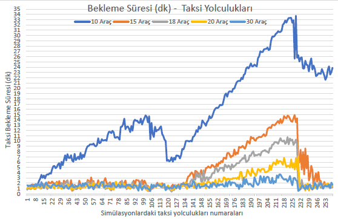
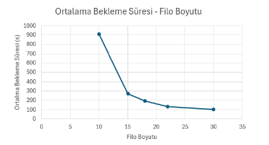
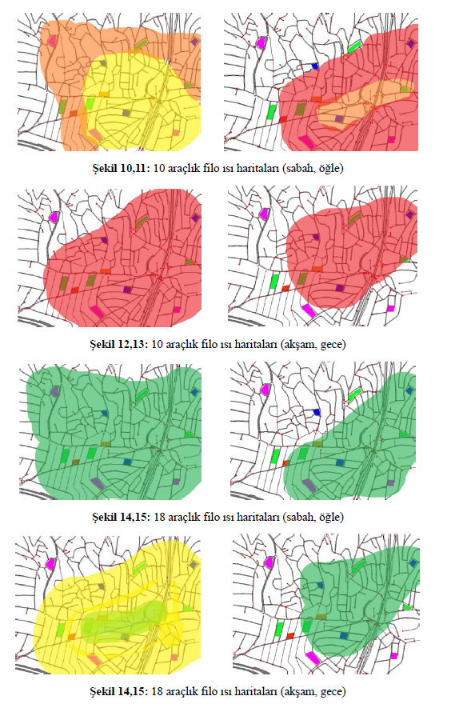

# 🚕 Autonomous Fleet Simulation & Optimization (Eclipse SUMO)

A comprehensive simulation study focused on evaluating and optimizing autonomous taxi fleet performances under dynamic, non-homogeneous urban demand. Using the topology of Kavacık, Istanbul, this project analyzes routing algorithms, fleet sizing, and spatial delay variances.

## ✨ Key Methodologies & Features

* **🗺️ Custom Map Integration:** Imported and customized a real-world urban topology using Netedit (`kavacik.net.xml`), specifically designating various points of interest like residential and commercial zones (`poly1.add.xml`).
* **📈 Probabilistic Demand Modeling:** Replaced static vehicle routing with dynamic, probability-driven daily scenarios to simulate realistic urban traffic and bottlenecks (`kavacik.rou.xml` & `taksi_senaryo.rou.xml`).
* **⚖️ "Elbow" Capacity Optimization:** Conducted a marginal utility analysis across varying fleet sizes using a greedy dispatch algorithm to find the exact point where customer wait times and fleet idle periods are perfectly balanced (`analiz_raporu.xml`).
* **📍 Spatial Heatmap Analysis:** Evaluated algorithmic clustering behaviors and regional service inequalities by generating spatial delay heatmaps.

## 🛠️ Tech Stack

* **Simulation Environment:** Eclipse SUMO (Simulation of Urban Mobility)
* **Configuration & Routing:** XML
* **Data Analysis:** Processed raw millisecond-precision simulation logs for statistical optimization.

## 📸 Simulation & Results Showcase

### 1. Chronological Wait Times Across All Trips
A detailed view of how the system handles demand phases throughout a 24-hour cycle.


### 2. Fleet Optimization (Elbow Method)
Determining the optimal fleet size by analyzing the trade-off between the number of vehicles and the average wait time.


### 3. Regional Delay Variance (Heatmaps)
Visualizing spatial service inequalities and bottlenecks caused by autonomous fleet clustering.



## 🚀 How to Run the Simulation

To run this simulation locally, you must have [Eclipse SUMO](https://eclipse.dev/sumo/) installed on your machine.

1. Clone this repository:
```bash
   git clone [https://github.com/Ysfkcmz/Autonomous-Fleet-Simulation-SUMO.git](https://github.com/Ysfkcmz/Autonomous-Fleet-Simulation-SUMO.git)
   ```
2. Navigate to the project directory:
```bash
   cd Autonomous-Fleet-Simulation-SUMO
   ```
3. Run the simulation using the SUMO GUI:
```bash
   sumo-gui -c kavacik_sim.sumocfg
   ```
*(Note: Press the 'Play' button in the SUMO GUI and adjust the delay parameter to observe the traffic flow visually.)*

## 📄 Full Technical Report
This repository contains the core simulation files and visual data summaries. For a deep dive into the methodology or results please feel free to contact me directly to request the full academic report.
